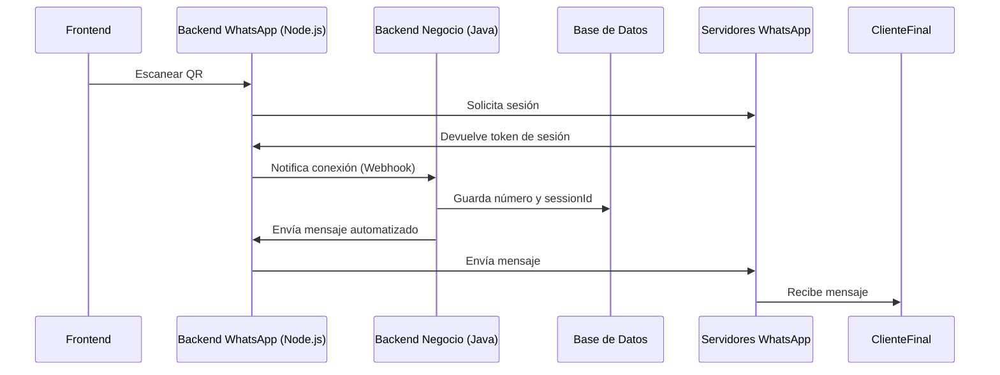

# WhatsApp Web API# 💬 WhatsApp Web API


Una API REST moderna para gestionar WhatsApp Web con Socket.IO en tiempo real.🟩 **Node.js + Express + Socket.IO**


## 🚀 CaracterísticasSistema completo para interactuar con WhatsApp Web desde un servidor Node.js:  

envío y recepción de mensajes, manejo de archivos multimedia, perfiles y comunicación en tiempo real.

- ✅ **Arquitectura profesional** con separación de responsabilidades

- ✅ **API REST** semántica y bien organizada## 🆕 **Últimas Mejoras (v2.0)**

- ✅ **Socket.IO** para comunicación en tiempo real

- ✅ **Manejo robusto de errores**✅ **Mensajes en Tiempo Real Optimizados**

- ✅ **Configuración centralizada**- Comunicación Socket.IO mejorada para mensajes entrantes

- ✅ **Estructura modular y escalable**- Procesamiento automático sin requerir polling del frontend

- Logs de debugging eliminados para mayor rendimiento

## 📁 Estructura del Proyecto

✅ **Código Limpio y Optimizado**

```- Eliminación de logs innecesarios de consola

src/- Código production-ready sin overhead de debugging

├── config/          # Configuración centralizada- Manejo de errores mejorado

├── controllers/     # Lógica de controladores (MVC)

├── services/        # Lógica de negocio (WhatsApp)✅ **Arquitectura Socket.IO Refinada**

├── routes/          # Definición de rutas REST- Manejo eficiente de salas de chat

├── middleware/      # Middleware personalizado- Eventos de conexión/desconexión optimizados

├── utils/           # Utilidades y helpers- Emisión directa a salas específicas

├── sockets/         # Manejo de Socket.IO

└── app.js          # Aplicación principal---

```

## ⚙️ Tecnologías principales

## 🛠️ Instalación

| Tecnología         | Función principal                           |

```bash|--------------------|---------------------------------------------|

npm install| 🟩 Node.js         | Entorno de ejecución                        |

```| 🚀 Express.js      | Servidor HTTP REST                          |

| 🔄 Socket.IO       | Comunicación en tiempo real                 |

## 🚀 Uso| 💬 whatsapp-web.js | Conexión y control de WhatsApp Web          |

| 📤 Multer          | Subida de archivos multimedia               |

### Desarrollo| 🧾 QRCode          | Generación de QR para autenticación         |

```bash| 🌐 Node-Fetch      | Descarga de archivos remotos                |

npm run dev| 💾 FS / Path       | Almacenamiento local en disco               |

```

---

### Producción

```bash## 🧭 Endpoints REST API

npm start

```| Método | Ruta                          | Descripción                                             | Parámetros                      |

|--------|-------------------------------|---------------------------------------------------------|---------------------------------|

## 📋 API Endpoints| GET    | `/qr`                         | Devuelve el código QR actual para vincular WhatsApp.    | —                               |

| GET    | `/chats`                      | Lista los chats disponibles (ordenados por último mensaje). | —                          |

### Autenticación| GET    | `/me`                         | Devuelve los datos del usuario autenticado.             | —                               |

- `GET /api/auth/qr` - Obtener código QR| GET    | `/messages/:chatId`           | Obtiene mensajes de un chat.                            | `limit`, `before`               |

- `GET /api/auth/status` - Estado de conexión| POST   | `/send-message`               | Envía texto o archivo multimedia.                       | `chatId`, `message`, `file`     |

- `GET /api/auth/me` - Información del usuario| GET    | `/download-media/:messageId`  | Descarga archivo adjunto.                               | `messageId`                     |

- `POST /api/auth/logout` - Cerrar sesión| GET    | `/profile-photo/:chatId`      | Obtiene foto de perfil de contacto.                     | `chatId`                        |

| GET    | `/contact/:chatId`            | Devuelve datos de contacto (nombre, número, descripción, foto). | `chatId`               |

### Chats| POST   | `/contact/:chatId/photo`      | Sube manualmente una foto de contacto.                  | `file`                          |

- `GET /api/chats` - Lista de chats| POST   | `/contact/:chatId/description`| Actualiza la descripción de un contacto.                | `description`                   |

- `GET /api/chats/:chatId/messages` - Mensajes de un chat

- `POST /api/chats/:chatId/messages` - Enviar mensaje---

- `PUT /api/chats/:chatId/read` - Marcar como leído

## 🔄 Eventos en tiempo real (Socket.IO)

### Media

- `GET /api/media/:messageId` - Descargar archivo| Evento       | Dirección              | Descripción                                             |

- `GET /api/media/profile/:chatId` - Foto de perfil|--------------|-----------------------|---------------------------------------------------------|

| `qr`         | 🔁 Servidor → Cliente  | Envía el QR generado para conectar la sesión.           |

### Compatibilidad (Rutas Legacy)| `ready`      | 🔁 Servidor → Cliente  | Notifica cuando WhatsApp está listo y conectado.        |

Las siguientes rutas mantienen compatibilidad con versiones anteriores:| `message`    | 🔁 Servidor → Cliente  | Envía mensajes nuevos al chat correspondiente.          |

- `GET /qr` → `/api/auth/qr`| `join`       | 🔁 Cliente → Servidor  | Cliente se une a una sala específica.                   |

- `GET /status` → `/api/auth/status`| `disconnect` | 🔁 Automático          | Detecta desconexiones.                                  |

- `POST /logout` → `/api/auth/logout`

- `GET /chats` → `/api/chats`---

- Y más...

## 🧠 Ejemplos de respuesta JSON

## 🔌 Socket.IO Events

### 🗂️ Chat (`GET /chats`)

### Cliente → Servidor```json

- `join` - Unirse a un chat{

- `leave` - Salir de un chat  "id": "5491122334455@c.us",

- `request-chats` - Solicitar lista de chats  "name": "Juan Pérez",

- `logout` - Cerrar sesión  "lastMessageTimestamp": 1696422050,

  "unreadCount": 2

### Servidor → Cliente}

- `qr` - Código QR generado```

- `ready` - WhatsApp conectado

- `message` - Nuevo mensaje### 💬 Mensaje (`GET /messages/:chatId`)

- `chats-updated` - Lista de chats actualizada```json

- `disconnected` - WhatsApp desconectado{

  "id": "ABC123",

## ⚙️ Configuración  "body": "Hola!",

  "fromMe": false,

Las configuraciones se encuentran en `src/config/index.js`:  "timestamp": 1696422050,

  "sender": "5491122334455@c.us",

- **Puerto del servidor**: 3000 (por defecto)  "type": "chat",

- **CORS**: Habilitado para todos los orígenes  "mediaUrl": null

- **Límite de archivos**: 50MB}

- **Límite de mensajes**: 50 por defecto```


## 📖 Documentación Detallada---


Ver [README-REFACTORED.md](./README-REFACTORED.md) para más detalles sobre la arquitectura y proceso de refactorización.## 🗃️ Almacenamiento local


## 🤝 Contribución| Recurso             | Tipo                  | Persistente | Carpeta           |

|---------------------|----------------------|-------------|-------------------|

1. Fork el proyecto| Sesión WhatsApp     | `LocalAuth()`        | ✅          | `.wwebjs_auth/`   |

2. Crea tu feature branch (`git checkout -b feature/AmazingFeature`)| Archivos subidos    | Temporales (Multer)  | ⚠️ No       | `/uploads/`       |

3. Commit tus cambios (`git commit -m 'Add some AmazingFeature'`)| Fotos y descripciones | Archivos locales    | ✅          | `/profile-data/`  |

4. Push al branch (`git push origin feature/AmazingFeature`)| Chats y QR          | Variables en memoria | ❌          | —                 |

5. Abre un Pull Request

---

## 📄 Licencia

## 📦 Estructura del proyecto

Este proyecto está bajo la Licencia ISC.
```
project-root/
│
├── uploads/             # Archivos temporales
├── profile-data/        # Fotos y descripciones
├── .wwebjs_auth/        # Sesión de WhatsApp (LocalAuth)
├── server.js            # Código principal
├── package.json
└── README.md
```

---

## 📤 Ejemplo: Envío de archivo

```
POST /send-message
Content-Type: multipart/form-data

Body:
  chatId = 5491122334455@c.us
  message = "Foto del producto"
  file = imagen.jpg
```

- 🗂️ Guardado temporalmente en `/uploads/`
- 🗑️ Eliminado automáticamente tras el envío.

---

## 🖼️ Diagrama de arquitectura



---

## 🚀 Ejecución rápida

```sh
npm install
node server.js
```
Abrir en navegador → [http://localhost:3000](http://localhost:3000)

---

## 🧩 Estado del sistema

| Elemento                    | Estado         | Descripción                    |
|-----------------------------|---------------|--------------------------------|
| Cliente WhatsApp conectado  | ✅            | Conexión activa y estable      |
| Socket.IO activo            | ✅            | Tiempo real funcionando        |
| Persistencia de sesión      | ✅            | LocalAuth configurado          |
| Mensajes en tiempo real     | ✅            | Sin polling, eventos directos  |
| Código optimizado           | ✅            | Sin logs innecesarios          |
| Base de datos externa       | ❌ No utilizada| Sistema independiente         |

---

## 📋 Notas de Desarrollo

### Configuración Socket.IO
- Puerto: `3000`
- CORS: Habilitado para todos los orígenes (`origin: "*"`)
- Salas automáticas por `chatId`

### Estructura de Mensajes
- **Individual**: `51925593795@c.us`
- **Grupo**: `120363417238560779@g.us`
- **Emisión**: `io.to(chatId).emit("message", formatted)`

### Flujo de Mensajes en Tiempo Real
1. WhatsApp → `client.on("message")` 
2. Formateo automático del mensaje
3. Emisión a sala específica via Socket.IO
4. Frontend recibe evento `message` instantáneamente